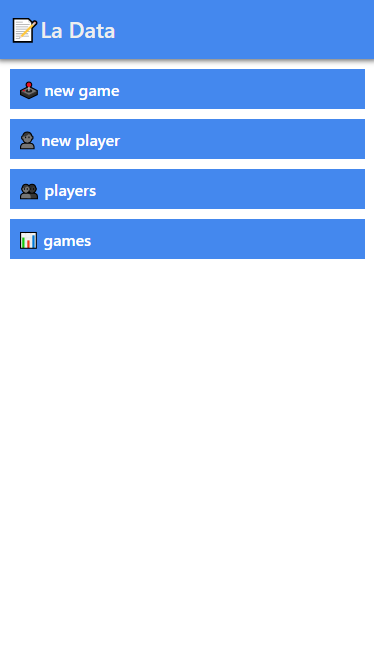
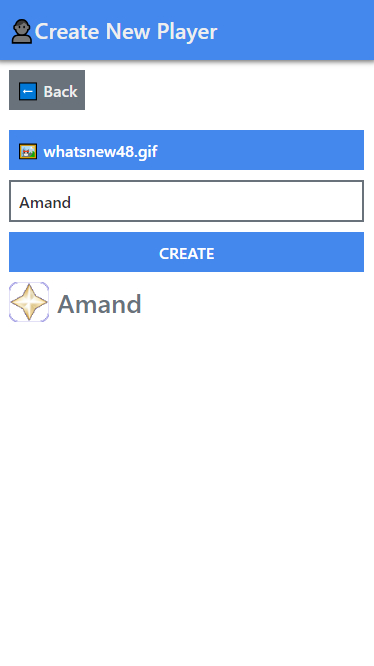
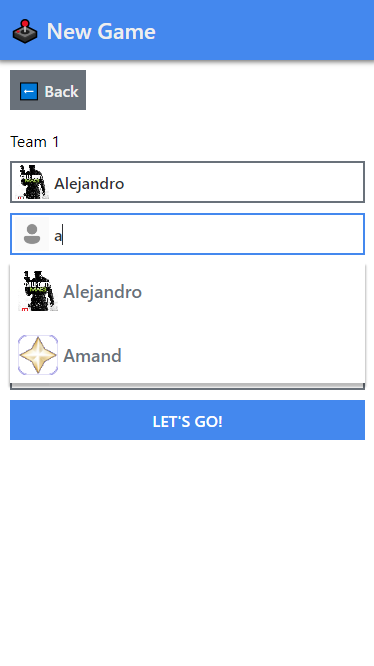
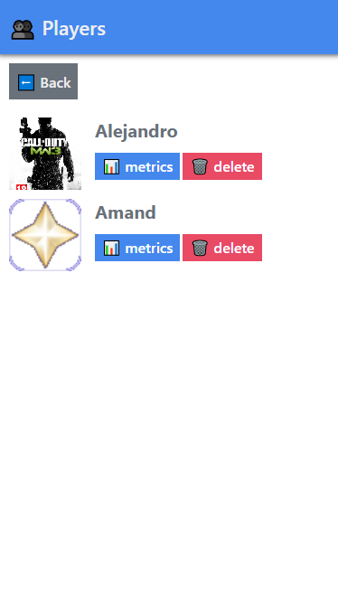

# LA DATA - Vanilla-Javascript

## Información respecto a el proyecto

Este proyecto es realizado con dos objetivos, el primero es utilizar `javascript` pero a un nivel **medio-avanzado** para desarrollar interfaces de usuarios, y el segundo es dejar de anotar las puntuaciones de los partidos de dominos en papel 😅.

## Tecnologias usadas

+ `typescript`: Para el tipado de datos y reducir el error a la hora de usar variables
+ `http-server`: Para montar el servidor de prueba

## Instalación

+ Clonar `git clone https://github.com/ajorgenmarten/spa-vanilla-js.git` o descargar el proyecto
+ Instalar dependencias `npm install` **(tener Nodejs instalado)**
+ En caso de hacer alguna modificación en el código, ejecutar `npm run build` para que se generen los archivos javascript
+ Con el comando `npm start` se inicia el proyecto, este comando tambien genera los archivos javascrit para el proyecto, si todo a ido correctamente puedes ver la app en la dirección http://localhost

## Imágenes

